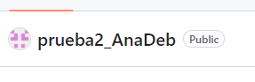
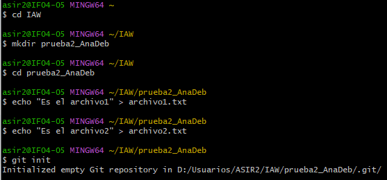
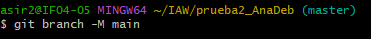
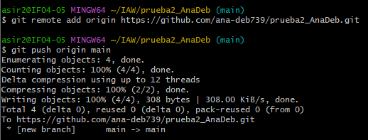
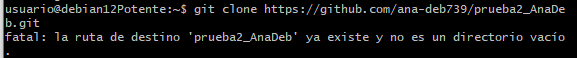
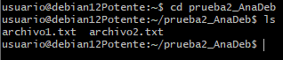
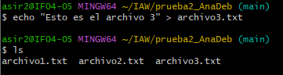
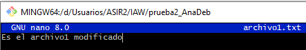
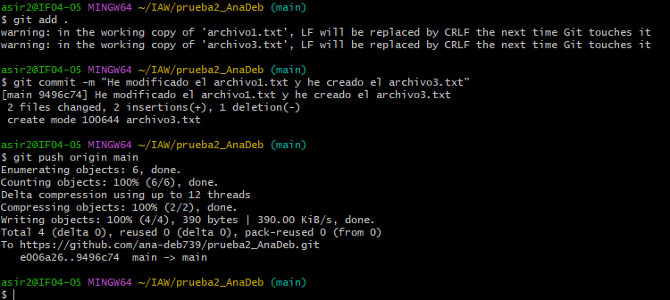
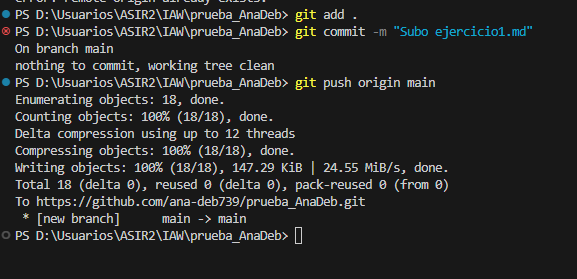

# EJERCICIO 1

Vamos a crear un nuevo repositorio llamado prueba2_tu_nombre.

Primero crea el repositorio local en Windows (usando git init).
El repositorio debe contener, al menos, dos archivos de texto: archivo1.txt y archivo2.txt. El contenido de ambos archivos es libre.

Agrega (conecta) el repositorio local con un repositorio remoto en GitHub (usando git remote add).

Sube el repositorio local a GitHub (usando git push).

Clona el repositorio remoto en tu máquina virtual Linux Debian (usando git clone).

Modifica, en Windows, uno de los archivos y añade un 3º archivo de texto llamado archivo3.txt. 

Confirma los cambios(usando git add, git commit) y súbelos al repositorio (usando git push).

Actualiza la versión local del repositorio en Linux Debian (usando git pull).

Subida al git

