# EJERCICIO 3

## Creación de ramas

- Crea una rama que se llame primera en un repositorio local, y ejecuta la instrucción necesaria para comprobar que se ha creado.

    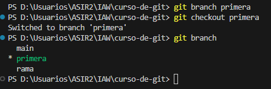
  
- Crea un nuevo fichero en esta rama y fusiónalo con la principal. ¿Se ha producido conflicto? Razona la respuesta.
  
  Creamos el fichero prueba.txt

  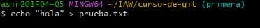

    Subimos el fichero

  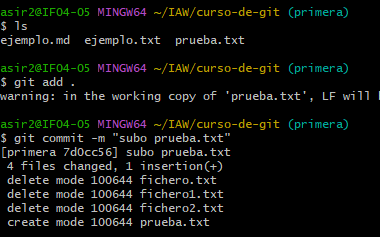

    Cambiamos de rama

  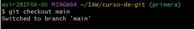

    Hacemos un git merge y podemos observar que no hay conflicto.

  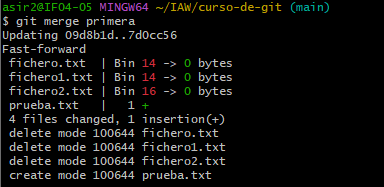
  
- Borra la rama primera.

    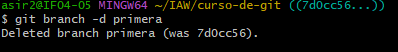
  
- Crea una rama que se llame segunda, y modifica un fichero en ella para producir un conflicto al unirlo a la rama principal. Entrega el contenido del fichero donde se ha producido el conflicto.

    Crear rama segunda

    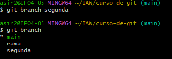

    Modifico ejemplo.txt en main

    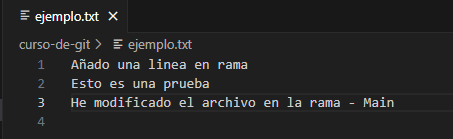

    Git add y Git commit de main

    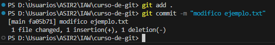

    Modifico ejemplo.txt en segunda

    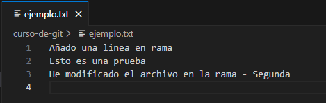

    Git add y Git commit de segunda

    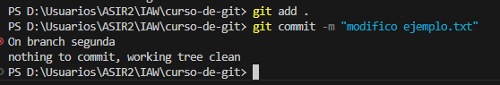
  
- Soluciona el conflicto que has creado en el punto anterior y sincroniza la rama segunda en el repositorio remoto en GitHub correspondiente. Entrega una captura de pantalla donde se vea que se ha creado la rama en el repositorio de GitHub.

  Git merge

    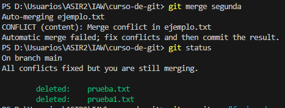

  Git commit

  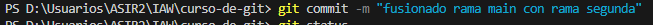

  Ramas Git Hub

  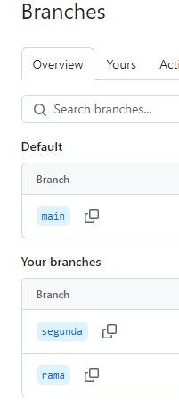

  Codigo arreglado

  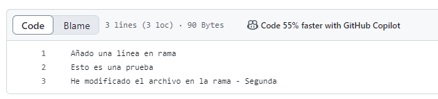
